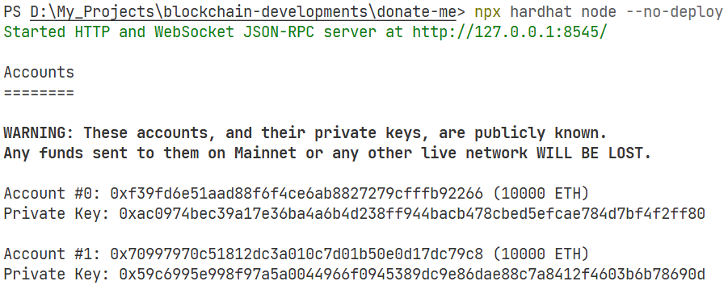
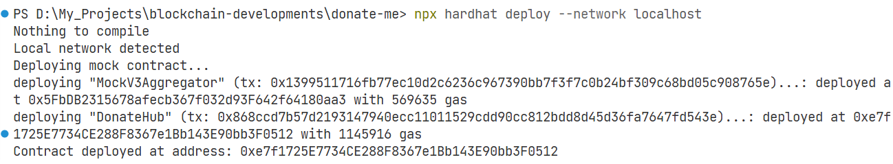
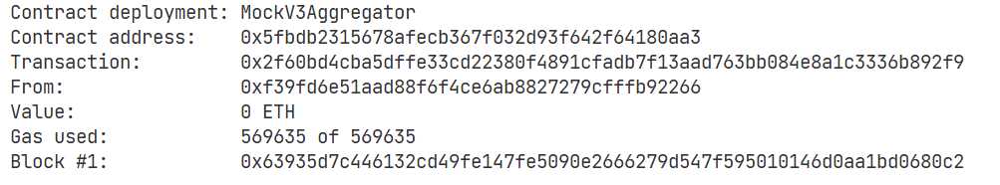
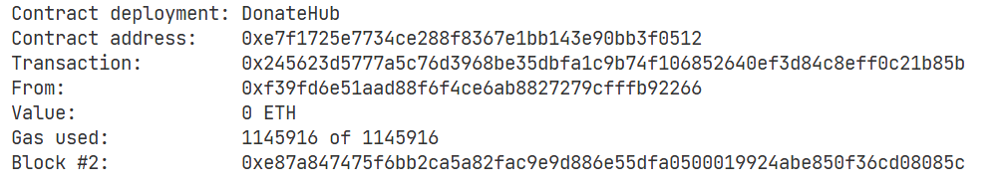
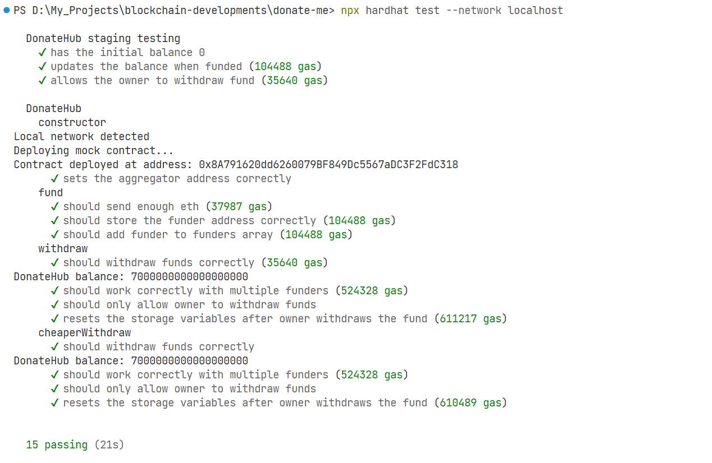
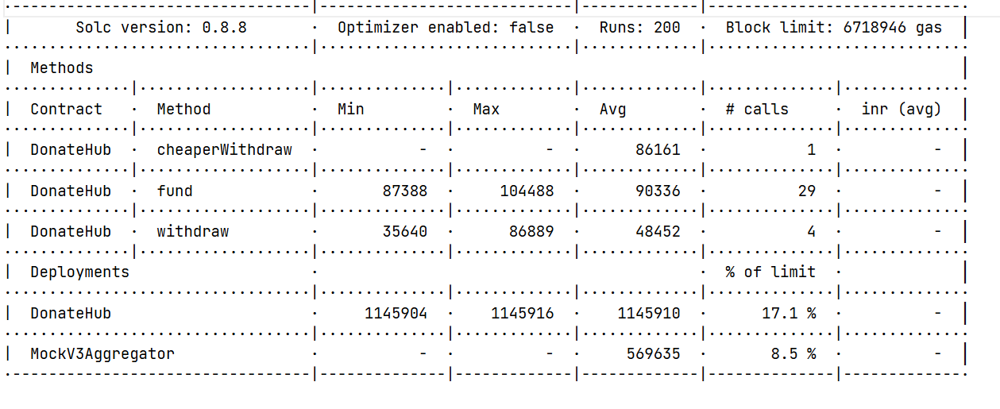
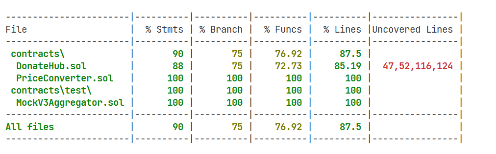

# 💰 DonateHub — Hardhat Testing Project

**DonateHub** is a Solidity-based smart contract that allows users to send ETH donations while keeping track of all contributions.  
This project focuses on demonstrating **testing**, **deployment**, **mocking**, **gas reporting**, and **coverage analysis** using the **Hardhat framework**.

---

## 🧠 Overview

The project includes:

- A smart contract `DonateHub.sol` that enables users to fund the contract.
- A `PriceConverter` library that integrates **Chainlink price feeds**.
- Local and testnet deployments (Sepolia).
- Unit tests, gas reports, and code coverage analysis.

---

## ⚙️ Project Setup

Clone the repository:

```bash
git clone https://github.com/aniketjejurkardev-tech/DonateHub.git
cd DonateHub
```

Install dependencies:

```bash
yarn init
yarn install
```

## 🧩 Dependencies Used

| Package                                                                                            | Description                                                                             |
| -------------------------------------------------------------------------------------------------- | --------------------------------------------------------------------------------------- |
| [Hardhat](https://hardhat.org/)                                                                    | Ethereum development environment for compiling, deploying, and testing smart contracts. |
| [@nomicfoundation/hardhat-toolbox](https://www.npmjs.com/package/@nomicfoundation/hardhat-toolbox) | A collection of useful Hardhat plugins and tools.                                       |
| [@chainlink/contracts](https://www.npmjs.com/package/@chainlink/contracts)                         | Provides Chainlink smart contract interfaces and libraries.                             |
| [dotenv](https://www.npmjs.com/package/dotenv)                                                     | Loads environment variables from a `.env` file.                                         |
| [hardhat-gas-reporter](https://www.npmjs.com/package/hardhat-gas-reporter)                         | Generates gas usage reports for smart contract tests.                                   |
| [solidity-coverage](https://www.npmjs.com/package/solidity-coverage)                               | Measures test coverage for Solidity smart contracts.                                    |

## 🌐 Network Configuration

The project supports both **development** and **testnet** environments.

### 🧱 Local Networks

- `localhost`
- `hardhat`

### 🧪 Testnet

- `sepolia`

> The `hardhat.config.js` file includes configuration settings for both local and test networks.

## 🚀 Deployment

### 1. Running a Local Hardhat Node

To start a local blockchain for development and testing, run:

```bash
npx hardhat node
```

When you run a local Hardhat node, it automatically generates **10 test accounts**. Each account includes:

- **Public Address** – This is like a “bank account number.” It consists of 42 hexadecimal characters (including the `0x` prefix) and is used to receive ETH from other accounts or contracts.

- **Private Key** – This is like your “PIN or password” for the account. It consists of 66 hexadecimal characters (including the `0x` prefix) and is required to spend or send ETH from the account.

- **Initial Balance** – Each account is pre-funded with **10,000 ETH (test ETH)**.  
  You can deploy contracts, test transactions, and run scripts without using real ETH.

Here is the image that shows how it looks after a local blockchain instance is initiated on Hardhat:

<p align="center">
  
</p>

### 2. Deploy the Contract

#### a) Deploy on Local Network

In a separate terminal, run:

```bash
npx hardhat deploy --network localhost
```

This deploys the following contracts:

- **MockV3Aggregator** – a mock for the Chainlink price feed.

- **DonateHub** – your main contract, which uses the mock’s address in its constructor.

<p align="center">
  
</p>

The above image shows the deployment process on the local Hardhat network.
First, the **MockV3Aggregator** (a mock price feed contract) was deployed, followed by the **DonateHub** contract, which references the mock contract’s address.

<p align="center">
  
</p>

This block represents the deployment details of the **MockV3Aggregator** contract, including its transaction hash, deployed address, and gas used.

<p align="center">
  
</p>

This block shows the deployment of the **DonateHub** contract, which utilizes the previously deployed mock contract for fetching price data.

#### b) Deploy to Sepolia Testnet

If deploying to **Sepolia**, first create a `.env` file in your project root and add the following:

```bash
SEPOLIA_RPC_URL=your_rpc_url_here
PRIVATE_KEY=your_wallet_private_key
```

Where to get these:

- **SEPOLIA_RPC_URL** – Sepolia node endpoint from:

  - [Alchemy](https://www.alchemy.com/)
  - [Infura](https://infura.io/)
  - [QuickNode](https://www.quicknode.com/)

- **PRIVATE_KEY** – Wallet private key from MetaMask:
  1. Open MetaMask and select your account.
  2. Click the three dots → **Account Details** → **Export Private Key**.
  3. Copy and paste it into the `.env` file (keep it secret!).

Then run:

```
npx hardhat run deploy/01-deploy-donateHub.js --network sepolia
```

This will deploy the smart contract to the Sepolia testnet. You can verify it on [Etherscan](https://sepolia.etherscan.io/)
by searching for the deployed contract address.

### 3. Running Scripts

You can interact with the DonateHub contract using scripts. These scripts use the test accounts generated by the local Hardhat network.

**Donate ETH**  
Run the script to donate 0.1 ETH (as specified in the script):

```bash
npx hardhat run scripts/donate-eth.js --network localhost
```

**Withdraw Eth**  
Run the script to withdraw all ETH to the deployer account:

```bash
npx hardhat run scripts/withdraw.js --network localhost
```

### 4. Testing

Testing ensures the contract behaves as expected under different scenarios. Run all tests with:

```
npx hardhat test --network localhost
```

<p align="center">  </p>

The above image shows the results of running the tests on the local Hardhat network, verifying that donations and withdrawals work correctly.

### 5. Gas Report

A gas report analyzes the gas consumption of each function in the smart contract.

Enable it in `hardhat.config.js`:

```javascript
require("hardhat-gas-reporter");

module.exports = {
  gasReporter: {
    enabled: true,
    currency: "USD",
    coinmarketcap: process.env.COINMARKETCAP_API_KEY,
  },
};
```

Where to get `COINMARKETCAP_API_KEY`:

1. Go to [CoinMarketCap](https://coinmarketcap.com/api/) API.
2. Sign up or log in.
3. Create a free API key.
4. Add it to your .env file:

```
COINMARKETCAP_API_KEY=your_api_key_here
```

Then run the tests:

```
npx hardhat test --network localhost
```

<p align="center">  </p>
The gas report shows the gas consumption for each function in the contract, helping you understand the cost of executing each action.

### 6. Coverage Report

The coverage report ensures that all parts of the smart contract are properly tested, giving confidence that no functionality is missed.

Run the coverage report using:

```bash
npx hardhat coverage
```

<p align="center">  </p>
The coverage report tells us how much of our code got tested. Most of DonateHub.sol is covered—about 90% of statements and 77% of functions—with just a few lines not hit.

### 7. Project Structure

The project is organized as follows:

```bash
/
├── contracts/
│   ├── DonateHub.sol
│   ├── PriceConverter.sol
│   └── test/
│       └── MockV3Aggregator.sol
├── deploy/
│   ├── 00-deploy-mocks.js
│   └── 01-deploy-donateHub.js
├── scripts/
│   ├── donate-eth.js
│   └── withdraw.js
├── utils/
│   └── verify.js
├── images
├── test/
│   ├── unit/
│   │   └── DonateHub.test.js
│   └── staging/
│       └── DonateHub.staging.test.js
├── helper-hardhat-config.js
├── hardhat.config.js
├── .env.example
├── gas-report.txt
├── package.json
├── yarn.lock
└── README.md
```
